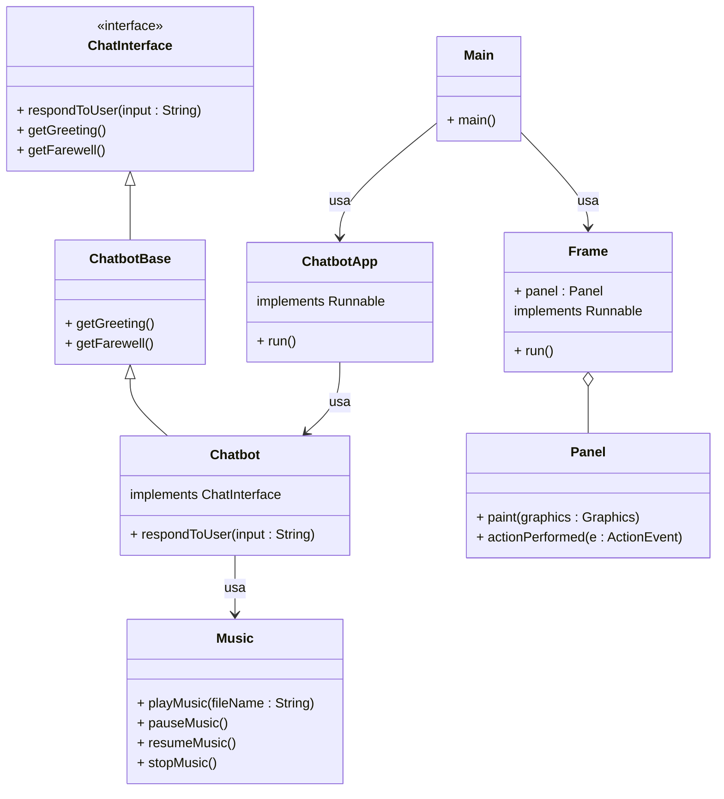
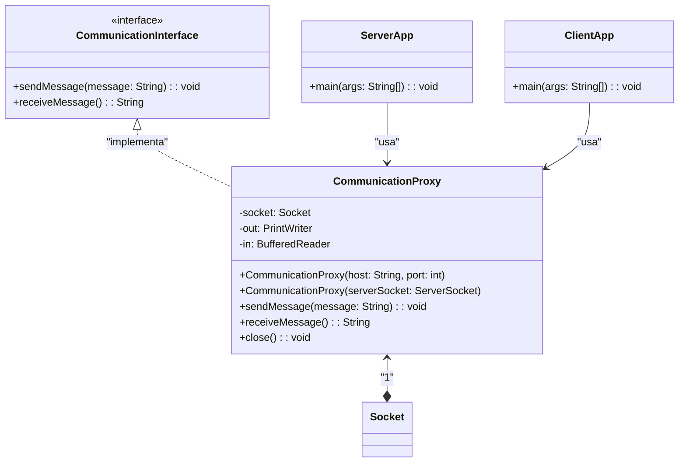

# Proyecto Multihilo con Chatbot, Reproducción de Archivos de Audio y GUI
La aplicación realizada fue codificada usando el lenguaje de programación Java, en la cual se implementaron bastantes aspectos propios de la programación orientada a objetos. El principal objetivo era el uso de Runnable y Threads para que de esta manera la aplicación tuviese 3 procesos simultáneos (multihilo):

- Una interfaz gráfica.
- La reproducción de un archivo de audio.
- Una aplicación de consola: Se implementó un chatbot con funcionalidades sencillas que permiten el control de la reproducción de un archivo de audio.

## Diagrama UML

## Aplicación de Sockets

Adicionalente, se incluyó una aplicación de comunicación vía Sockets, implementando Threads o hilos de igual manera, se obtuvo un diagrama UML de
clases como se indica a continuación:

